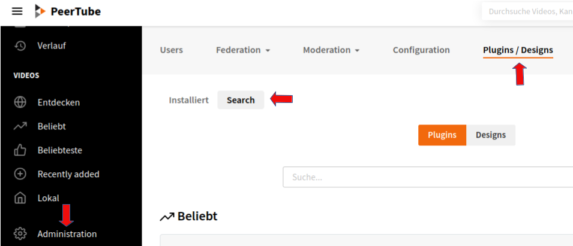
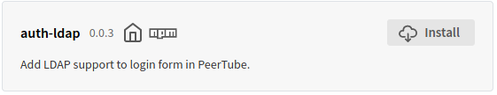
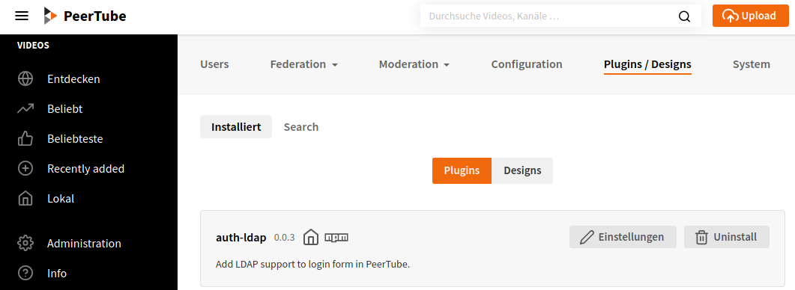
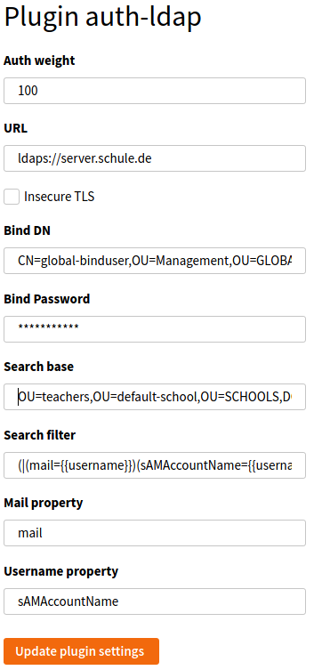

# create-peertube-container

Erstellt einen Peertube Docker-Container.  
Basiert auf https://github.com/Chocobozzz/PeerTube.

## Voraussetzung:

* Lokal: ansible + git installiert
* Remotehost:
  - Ubuntu 18.04 oder 20.04
  - Installierte Pakete: docker.io, docker-compose, nginx, dehydrated
  - passwortloser ssh-Zugang für Sudo-Benutzer

## Inbetriebnahme:

* Repo klonen: ``git clone https://github.com/linuxmuster/linuxmuster-docker.git``
* Ins Verzeichnis wechseln: ``cd linuxmuster-docker/create-peertube-container``
* hosts-Datei kopieren: ``cp hosts.ex hosts``
* in hosts-Datei IP-Adresse oder FQDN des Remotehosts eintragen.
* Playbook-Datei kopieren: ``cp peertube.yml.ex peertube.yml``
* Playbook anpassen (siehe Zeilen mit "### anpassen"):
  - remote_user: Name des Remote-Users auf dem Dockerhost,
  - rootpw: Initiales Root-Passwort der Peertube-Instanz und
  - hostname: FQDN der Peertube-Instanz
* Falls eigener Mailserver zur Verfügung steht in ``templates/env`` die Mailrelay-Einträge anpassen.
* Dockerhost ausrollen: ``ansible-playbook -i hosts -K peertube.yml``
  Sudo-Passwort des Users wird abgefragt.
* Danach kann man sich als ``root`` per https auf der unter ``hostname`` angegebenen Adresse anmelden.
* Unter _Administration -> Plugins/Designs -> Search_ lässt man sich die installierbaren Plugins auflisten.  
  
* In der Pluginliste sucht man das auth-ldap-Plugin und installiert es.
  
* Unter _Administration -> Plugins/Designs -> Installiert_ öffnet man die Einstellungen des Plugins.
  
* Das Formular ist mit den entsprechenden Werten auszufüllen:  
  
  Bezeichnung       | Wert
  ------------------|-----------------------------------------------------------------------
  URL               | ``ldaps://server.example.org``
  Bind DN           | ``CN=global-binduser,OU=Management,OU=GLOBAL,DC=example,DC=org``
  Bind Password     | (siehe auf dem Server in ``/etc/linuxmuster/.secret/global-binduser``)
  Search base       | ``OU=teachers,OU=default-school,OU=SCHOOLS,DC=example,DC=org``
  Search filter     | ``(\|(mail={{username}})(sAMAccountName={{username}}))``
  mail              | ``mail``
  Username property | ``sAMAccountName``
